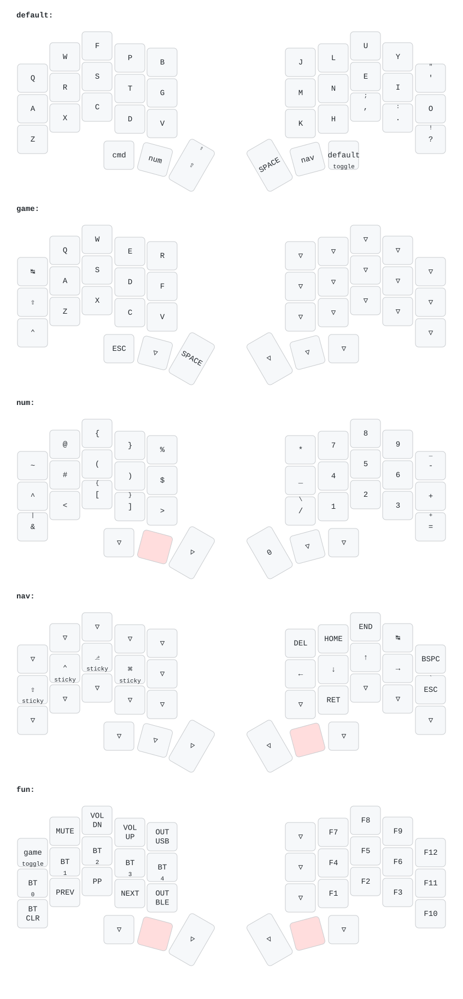

# Omega

My personal [ZMK](https://zmk.dev/) configuration for the **Omega**, a wireless
36-key split keyboard based on the
[Chocofi Temper](https://github.com/raeedcho/chocofi-temper) hardware.

## Features

- Colemak-DH
- Homerow mods
- Caps Word
- Number, navigation, function and command layers
- Vim-inspired navigation
- Five Bluetooth profiles
- USB/Bluetooth output switching
- Deep sleep

## Layers

| Layer       | Description                                         |
| ----------- | --------------------------------------------------- |
| **Default** | Colemak-DH with homerow mods                        |
| **NUM**     | Numbers and symbols                                 |
| **NAV**     | Navigation and sticky modifiers                     |
| **FUN**     | Function keys, media, Bluetooth and output controls |
| **CMD**     | GUI-based shortcuts                                 |

## Hardware

Omega is based on the
[Chocofi Temper](https://github.com/raeedcho/chocofi-temper) design and uses
nice!nano-compatible nRF52840 controllers.

## License

MIT

## Keymap preview:

